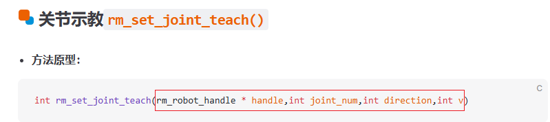
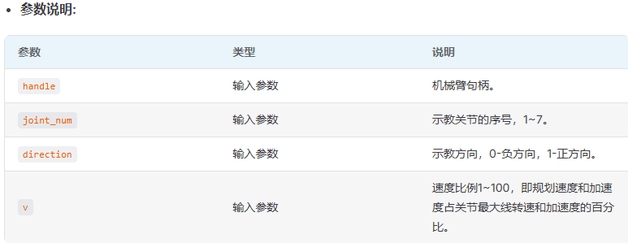
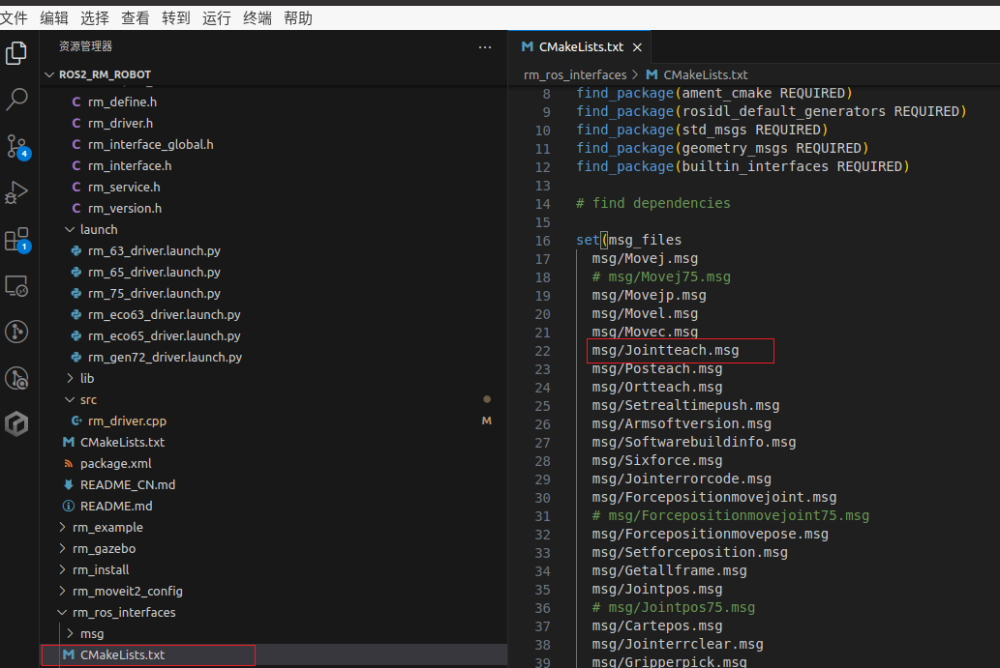
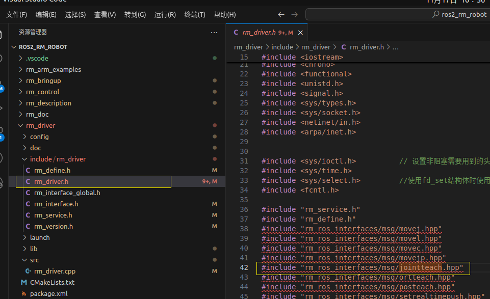
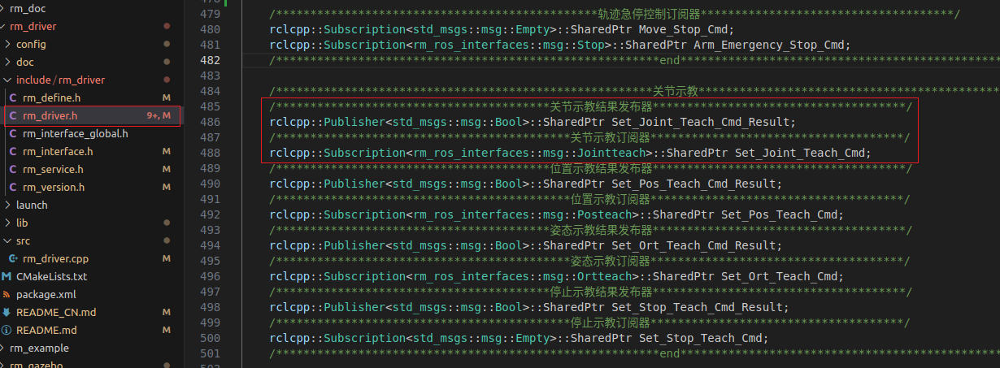
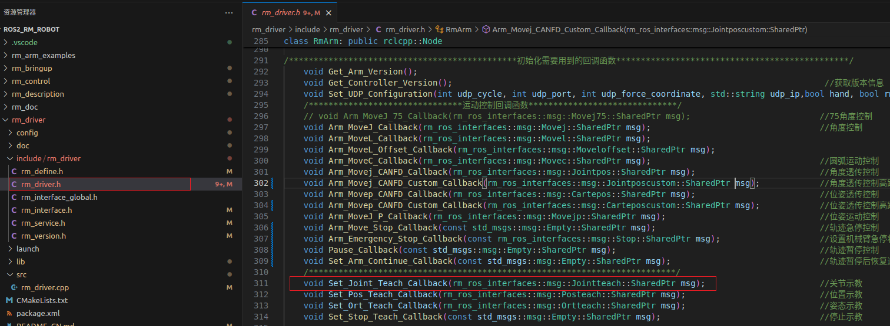
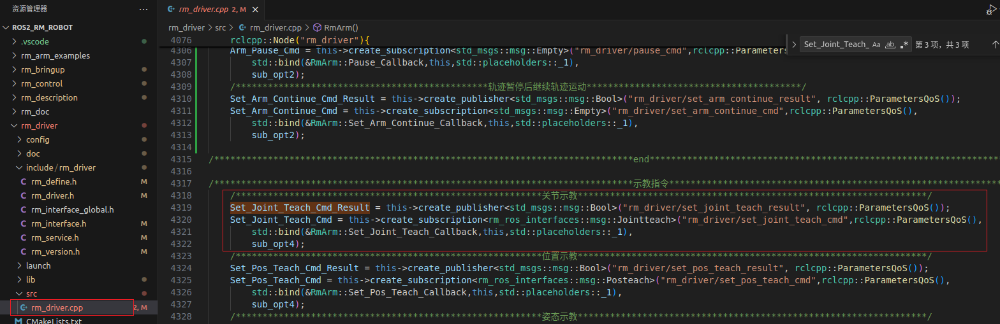
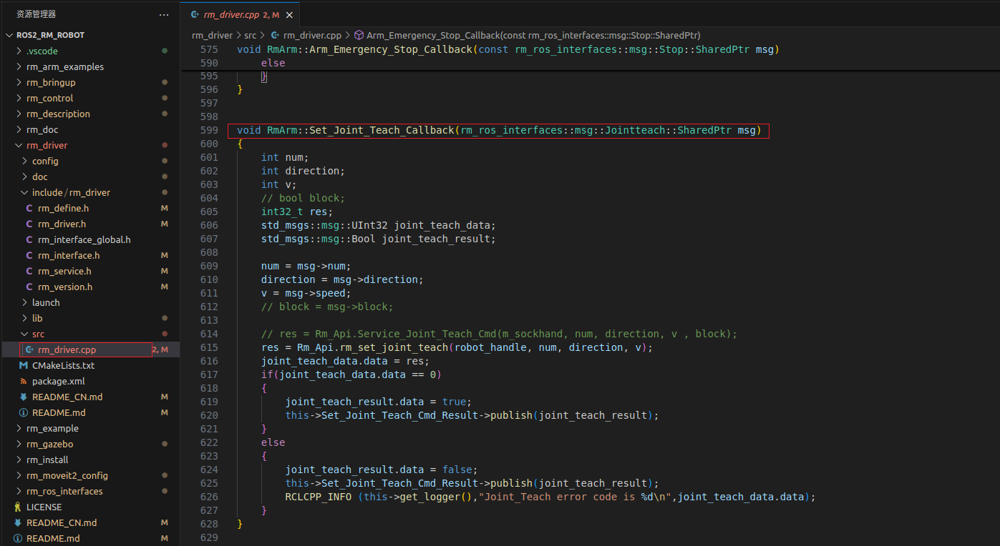

<div align="right">
 
[简体中文](https://github.com/RealManRobot/ros2_rm_robot/blob/humble/rm_driver/doc/%E7%9D%BF%E5%B0%94%E6%9B%BC%E6%9C%BA%E6%A2%B0%E8%87%82ROS%E9%A9%B1%E5%8A%A8%E5%8C%85%E5%8A%9F%E8%83%BD%E6%8B%93%E5%B1%95%E8%AF%B4%E6%98%8E.md)|[English](https://github.com/RealManRobot/ros2_rm_robot/blob/humble/rm_driver/doc/Description%20of%20Function%20Expansion%20for%20Realman%20Robotic%20Arm%20ROS%20Driver%20Package.md)

</div>

<div align="center">

# 睿尔曼机械臂ROS驱动包功能拓展说明V1.0
 
睿尔曼智能科技（北京）有限公司 
文件修订记录：
|版本号 | 时间 | 备注 |
| :---: | :---- | :---: |
|V1.0 | 2025-11-14 | 拟制 |

</div>

## 目录
* 1[简介](#简介)
* 2[主要环境概览](#主要环境概览)
* 3[添加ROS机械臂驱动包功能说明](#添加ROS机械臂驱动包功能说明)
* 4[机械臂驱动包话题添加](#机械臂驱动包话题添加)
* 4.1[定义msg文件](#定义msg文件)
* 4.2[在rm_driver.h中添加定义和包含](#在rm_driver_h中添加定义和包含)
* 4.3[在rm_driver.cpp中添加相关实现](#在rm_driver_cpp中添加相关实现)

## 简介

由于目前ROS开发包的制作主要是给大家做一个功能和使用的示例，所以大家想要使用的话题有可能rm_driver功能包里面并没有，针对这种情况为方便大家使用添加此文档，该文档主要介绍如何在rm_driver中添加其中本身并没有的话题。（特此说明，本文档仅为方便大家使用，并不承担二次开发工作中所遇到的问题）。

## 主要环境概览

* 系统  
ROS2目前有两个版本，Foxy和Humble，Foxy需要运行在Ubuntu20.04系统上，Humble需要运行在Ubuntu22.04的系统上。
* 参考文档  
ROS2当前是强依赖于API进行设计的，在进行开发时我们需要参考API文档。  
三代控制器的API文档[链接](https://develop.realman-robotics.com/robot/apic/getStarted/)；  
四代控制器的API文档[链接](https://develop.realman-robotics.com/robot4th/apic/getStarted/)。

## 添加ROS机械臂驱动包功能说明

**当前在rm_driver中添加话题主要分为以下几个步骤**
* 1.定义需要的msg文件。
* 2.在rm_robot.h文件中添加msg头文件包含。
* 3.在rm_robot.h文件中声明订阅器和发布器。
* 4.在rm_driver.cpp文件中初始化订阅器和发布器。
* 5.在rm_driver.cpp文件中实现回调函数。

## 机械臂驱动包话题添加

下面我们进行一下一个实际的话题添加动作，这里我们以关节示教为例进行添加。

### 定义自己的msg
* 新建msg文件
首先我们需要进行msg文件的定义，msg文件中有哪些变量取决于这个接口在API中是什么样子。  
   
如上图所示该函数有以上元素，每个元素解释如下。  
   
下面在rm_ros_interfaces功能包的msg文件夹下我们添加Jointteach.msg文件，定义其中的变量如下。
   
* 修改CMakeLists.txt
新建文件后我们需要在CMakeLists.txt中进行添加，具体添加内容如下。
  
通过如上操作，我们定义了了一个新的msg文件，后续我们可以通过头文件进行调用。
### 在rm_driver_h中添加定义和包含
我们需要在rm_driver.h中添加以下内容
* 1.首先需要添加头文件包含
如新定义的Jointteach.msg消息文件的头文件包含如下：  
#include "rm_ros_interfaces/msg/jointteach.hpp"  

* 2.接下来需要添加订阅器和发布器的定义  
//关节示教结果发布器  
rclcpp::Publisher<std_msgs::msg::Bool>::SharedPtr Set_Joint_Teach_Cmd_Result;  
//关节示教订阅器  
rclcpp::Subscription<rm_ros_interfaces::msg::Jointteach>::SharedPtr Set_Joint_Teach_Cmd;  

* 3.添加回调函数的声明  
回调函数名称没有要求，当前统一采用首字母大写的命名格式。
void Set_Joint_Teach_Callback(rm_ros_interfaces::msg::Jointteach::SharedPtr msg);                       //关节示教  

### 在rm_driver_cpp中添加相关实现
我们需要在rm_driver.cpp中添加以下内容
* 1.初始化订阅器和发布器  
需要在RmArm构造函数中初始化之前声明的订阅器和发布器，需要定义其话题名称。

    ``` C++
    /*********************************************************关节示教*****************************************************************/
    Set_Joint_Teach_Cmd_Result = this->create_publisher<std_msgs::msg::Bool>("rm_driver/set_joint_teach_result", rclcpp::ParametersQoS());
    Set_Joint_Teach_Cmd = this->create_subscription<rm_ros_interfaces::msg::Jointteach>("rm_driver/set_joint_teach_cmd",rclcpp::ParametersQoS(),
        std::bind(&RmArm::Set_Joint_Teach_Callback,this,std::placeholders::_1),
        sub_opt4);
    ```
    如上我们定期发布发布器的话题名称为rm_driver/set_joint_teach_result，订阅器的名称为rm_driver/set_joint_teach_cmd。  
    订阅器的主要作用为接收外部的话题指令，如上为接受外部的关节示教指令，根据示教指令的参数信息进行运动。  
    发布器的主要作用为完成运动后将运动的结果发布给用户，用户需要订阅该话题了解运动是否成功。  
    其中Set_Joint_Teach_Callback函数为其回调函数，名称需要与之前在rm_driver.h中定义的名称一致。  
    
* 2.回调函数实现  
需要实现回调函数的具体功能：

    ``` C++
    void RmArm::Set_Joint_Teach_Callback(rm_ros_interfaces::msg::Jointteach::SharedPtr msg)
    {
        int num;
        int direction;
        int v;
        // bool block;
        int32_t res;
        std_msgs::msg::UInt32 joint_teach_data;
        std_msgs::msg::Bool joint_teach_result;

        num = msg->num;
        direction = msg->direction;
        v = msg->speed;
        // block = msg->block;

        // res = Rm_Api.Service_Joint_Teach_Cmd(m_sockhand, num, direction, v , block);
        res = Rm_Api.rm_set_joint_teach(robot_handle, num, direction, v);
        joint_teach_data.data = res;
        if(joint_teach_data.data == 0)
        {
            joint_teach_result.data = true;
            this->Set_Joint_Teach_Cmd_Result->publish(joint_teach_result);
        }
        else
        {
            joint_teach_result.data = false;
            this->Set_Joint_Teach_Cmd_Result->publish(joint_teach_result);
            RCLCPP_INFO (this->get_logger(),"Joint_Teach error code is %d\n",joint_teach_data.data);
        }
    }
    ```
    如上所示为回调函数的具体实现将接收到的msg参数给到对应变量并赋值给rm_set_joint_teachAPI函数，根据其返回值发布对应结果。  
    
